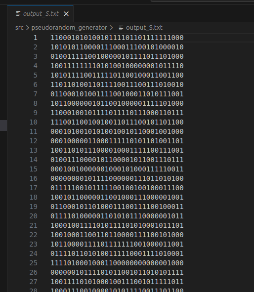
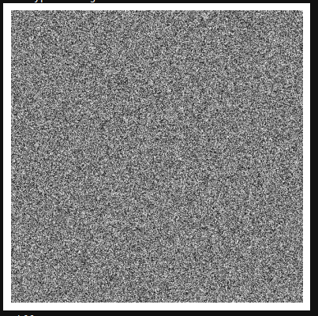

# A Hardware-Efficient Chaotic PRNG Exploring Posit Arithmetic for Secure Image Encryption

## Overview

Chaotic systems are attractive for digital and embedded applications due to their inherent unpredictability and sensitivity to initial conditions, making them suitable for applications such as image encryption. However, their implementation in digital hardware often suffers from dynamical degradation caused by limited numerical precision, leading to short periodic orbits and significantly reducing their effectiveness in security-related applications. Additionally, embedded systems impose strict constraints on hardware resources. To address these limitations, this work proposes a hardware-efficient pseudo-random number generator (PRNG) based on a Sugeno-approximated sine-map implementation. The design targets image-encryption applications and is optimized for field-programmable gate array (FPGA)–based embedded systems. We first approximate the sine map using a lightweight Sugeno fuzzy inference system, replacing costly trigonometric operations and enabling implementation with only one addition unit and one multiplication unit; second, we introduce a perturbation mechanism to mitigate finite-precision degradation.

## How It Works

The PRNG uses a Sine Map function approximated through a simple Sugeno Fuzzy inference system. The main VHDL module, `src/pseudorandom_generator/complete_scheme.vhdl`, contains the main PRNG implemented:
- It takes an initial seed value.
- Applies the Sine Map approximation using Posit arithmetic.
- Uses a shift register and masking logic to enhance randomness.
- Outputs a new pseudorandom value at each iteration.

## Repository Organization

- `src/pseudorandom_generator/`
  - `complete_scheme.vhdl`: Main VHDL implementation of the PRNG.
  - `tb_complete_sine_map_scheme.vhd`: Comprehensive testbench for simulation and validation.
  - `input_A.txt`: Example input seed value in Posit<32,2> format.
  - `tb_script.do`, `wave.do`: ModelSim simulation automation script.

- `src/tools/`
  - `double_to_posit.py`: Converts IEEE 754 double-precision floats to Posit representation.
  - `posit_lookup_table.py`: Generates comprehensive lookup tables mapping Posit values to floats.
  - `posit_to_float.py`: Converts Posit bit-strings to floating-point equivalents.

- `src/image_encryption/`
  - `image_encryption.ipynb`: Software-in-the-Loop (SIL) and Hardware-in-the-Loop (HIL) implementations of the image encryption scheme.
  - `images/`: Test image dataset for encryption validation.

- `image_docs/`: Documentation images

## Requirements

| Requirement | Version | Purpose |
|------------|---------|---------|
| [ModelSim](https://www.altera.com/downloads/simulation-tools/modelsim-fpgas-standard-edition-software-version-18-1) | 18.1+ | FPGA simulation and verification |
| Python | 3.12.3+ | Utility tools and test vector generation |
| Jupyter Notebook | 6.4.12+ | Interactive image encryption demonstrations |

## Getting Started

### Running Simulations with ModelSim

1. **Open ModelSim** and set your working directory to `src/pseudorandom_generator/`.

2. **Compile the VHDL files**:
   ```bash
   vcom complete_scheme.vhdl
   vcom tb_complete_sine_map_scheme.vhd
   ```

3. **Configure the input seed** by editing `input_A.txt` as needed. The seed must be specified in Posit<32,2> binary format.

4. **Run the simulation** using the provided automation script:
   ```bash
   vsim -do tb_script.do
   ```

5. **Visualize results** through the ModelSim UI. Expected output and waveforms are displayed in the integrated waveform viewer, as shown below:


6. **An Output file** called "output_S.txt" is generated with the iterations of the PRNG, as the example below:


## Image Encryption Simulation

Open `src/image_encryption/image_encryption.ipynb` with **Jupyter Notebook** or **JupyterLab** and execute all cells to reproduce the image-encryption workflow. We recommend using **Kernel → Restart & Run All** to start from a clean state.

Below are example images produced by the notebook. Original (left) and encrypted (right):

| Original | Encrypted |
|---:|:---|
|  |  |


## Utility Tools

This repository includes a suite of conversion tools facilitating seamless interoperability between Posit and IEEE 754 number systems used for troubleshooting:

- **double_to_posit.py**  
  Converts IEEE 754 double-precision floating-point numbers to their Posit representation. Can be used for generating test vectors and determining initial condition for simulations.

- **posit_lookup_table.py**  
  Generates comprehensive lookup tables mapping all possible Posit values (for specified word size and exponent size) to their floating-point equivalents.

- **posit_to_float.py**  
  Converts Posit bit-strings to their floating-point equivalents.

---

## Contact & Support

For technical inquiries, questions regarding the implementation, or to report issues, please contact:

**Samuel da Silva**  
Email: [samuelsouza@ufmg.br](mailto:samuelsouza@ufmg.br)
